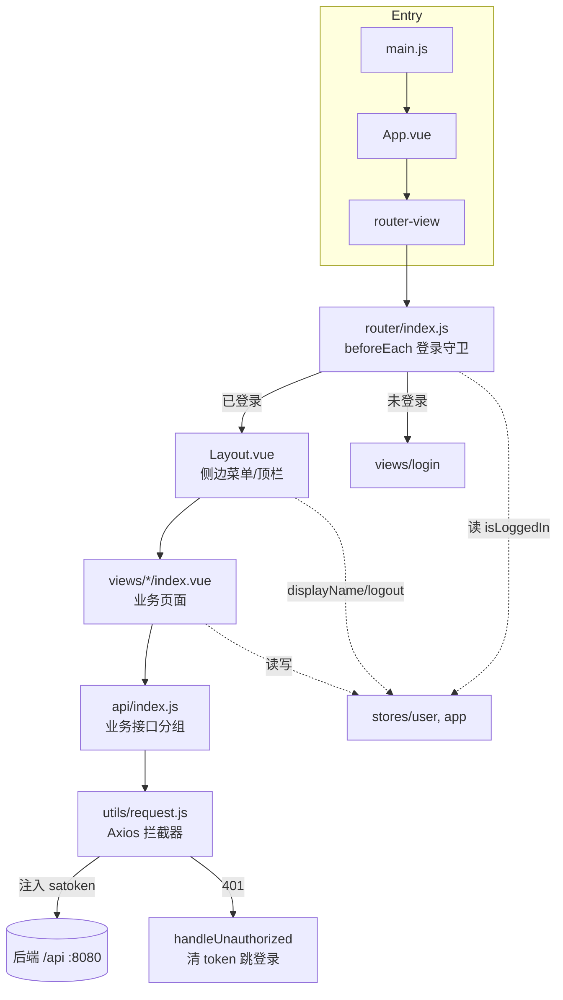

# fool-wms-front 项目总图（Project CodeMap）

> 生成时间：2026-07-08 17:22 ｜ 模式：`create_codemap(project)` ｜ 用途：代码上下文索引，供后续按需回读，避免全仓扫描。

## 0. 一句话定位

`fool-wms-front` 是 **Fool WMS 仓储管理平台** 的前端单页应用（供应链管理中台）。技术栈：**Vue 3（`<script setup>`）+ Vite 7 + Element Plus 2 + Pinia + Vue Router 4 + Axios**。后端通过 `/api` 代理到 `http://localhost:8080`，鉴权采用 **sa-token**（请求头注入 `satoken`）。

## 1. 技术基线

| 维度 | 选型 |
|---|---|
| 框架 | Vue `^3.5.17`（Composition API / `<script setup>`） |
| 构建 | Vite `^7.0.4` + `@vitejs/plugin-vue`，别名 `@ -> src`，dev 端口 `5174` |
| UI | Element Plus `^2.10.4` + `@element-plus/icons-vue`（全局注册全部图标，zh-cn 语言包） |
| 状态 | Pinia `^3.0.3`（setup store 写法） |
| 路由 | Vue Router `^4.5.1`（`createWebHistory`，全局前置守卫做登录拦截） |
| HTTP | Axios `^1.10.0`（统一封装 `src/utils/request.js`） |
| 其他 | dayjs、echarts + vue-echarts（图表） |
| 环境 | `.env.development`（`VITE_API_BASE_URL=/api`）/ `.env.production`；`VITE_USE_MOCK=false` |

## 2. 目录结构与分层

```
src/
├── main.js                 # 应用入口：装配 Pinia / Router / ElementPlus / 全局图标
├── App.vue                 # 根组件：仅承载 <router-view> + 全局样式 + 初始化 appStore
├── router/index.js         # 路由表 + 登录守卫（★ 核心）
├── api/index.js            # 全部后端接口聚合（按业务域分组导出）（★ 核心）
├── utils/
│   ├── request.js          # Axios 实例 + 拦截器 + 统一响应/鉴权处理（★ 核心）
│   └── index.js            # 通用工具：formatDate / deepClone 等（241 行）
├── stores/
│   ├── index.js            # store 聚合导出
│   ├── user.js             # 用户/登录/token/权限判定（★ 核心）
│   └── app.js              # UI 偏好：侧边栏/主题/语言/面包屑（localStorage 持久化）
├── components/
│   ├── Layout.vue          # 主框架：侧边菜单 + 顶栏 + 内容区（★ 核心，含菜单配置）
│   ├── ProvinceSelect.vue  # 省市区级联选择器
│   └── HelloWorld.vue      # 脚手架遗留
├── constants/
│   ├── dict.js             # 业务字典（枚举/状态）
│   └── regions.js          # 省市区数据
├── mock/                   # 本地假数据（api.js / warehouse.js），当前未接入（VITE_USE_MOCK=false）
├── views/                  # 页面（按业务域分目录，见 §4）
├── styles/common.css       # 品牌变量与公共样式（--brand-* 令牌）
└── style.css               # 基础样式
docs/                       # 历史开发笔记（CORS/代理/仓库接口实现等 7 篇）
```

**分层约定**：`views`（页面）→ 调用 `api/index.js`（接口层）→ 走 `utils/request.js`（HTTP 层）→ 后端。跨页面共享状态走 `stores`；`Layout.vue` 提供统一外壳。

## 3. 架构与数据流



### 关键链路：登录 → 鉴权闭环
1. `views/login` 调 `userStore.login(form)` → `authApi.login` 拿 `tokenValue`/`tokenName` 存 localStorage → `fetchUserInfo()` 拉 `authApi.me()` 存 `userInfo`（含 roles/permissions）。
2. 路由守卫 `router/index.js:beforeEach`：非 `meta.public` 路由校验 `userStore.isLoggedIn`，未登录带 `redirect` 跳 `/login`。
3. 每次请求 `request.js` 请求拦截器从 localStorage 读 token 注入到 `headers[tokenName]`（默认 `satoken`）。
4. 响应拦截器：`code===200||0 || success===true` 直接返回 `data`；`code===401` 或 HTTP 401 → `handleUnauthorized()` 清理并重定向 `/login`。
5. 权限判定：`userStore.hasPermission(perm)`（支持 `*` 通配）/ `hasRole(role)`。

## 4. 业务域与页面清单

菜单结构定义在两处（需保持同步）：**`Layout.vue` 的 `menuConfig`**（左侧菜单展示）与 **`router/index.js` 的 `routes`**（实际路由）。

| 业务域 | 页面路由 | 视图文件 | 规模 | 对应 API 分组 |
|---|---|---|---|---|
| 仪表盘 | `/dashboard` | views/dashboard | 196 | （echarts 展示） |
| 基础数据·货主 | `/owner` | views/owner | 158 | `ownerApi` |
| 基础数据·仓库 | `/warehouse` | views/warehouse | **587** ★ | `warehouseApi` |
| 基础数据·库区 | `/warehouse-area` | views/warehouse-area | 144 | `warehouseAreaApi` |
| 基础数据·库位 | `/location` | views/location | 159 | `locationApi` |
| 基础数据·物料 | `/materials` | views/materials | **615** ★ | `materialApi` |
| 库存 | `/inventory` | views/inventory | 197 | `inventoryApi` |
| 作业·入库 | `/inbound` | views/inbound | 272 | `inboundApi` / `inboundDetailApi` |
| 作业·出库 | `/outbound` | views/outbound | 270 | `outboundApi` / `outboundDetailApi` |
| 作业·盘点 | `/check` | views/check | 278 | `checkApi` / `checkDetailApi` |
| 系统·用户 | `/system/user` | views/system/user | 215 | `userApi` |
| 系统·角色 | `/system/role` | views/system/role | 143 | `roleApi` |
| 系统·权限 | `/system/permission` | views/system/permission | 141 | `permissionApi` |
| 登录 | `/login` | views/login | 164 | `authApi` |

★ `warehouse` 和 `materials` 是最大页面（各含较重的表单/字段逻辑），是维护热点。

### 4.1 孤立/占位页面（存在但未挂载路由）
以下视图存在于 `src/views` 但**未在 `router/index.js` 注册**，且多为「开发中」占位（`el-empty`）：
`inbound-outbound`、`orders`、`procurement`、`reports`、`settings`、`suppliers`。
→ 修改导航/清理死代码时需注意：它们不可通过路由访问。

## 5. API 接口索引（`src/api/index.js`，153 行）

按业务域分组导出，统一走 `request`。命名有两种风格并存：新域用 `list/add/update/delete/getById`（RESTful 短名），`warehouse`/`material` 域沿用旧视图命名（`getWarehouseList`/`createMaterial` 等，注释标注「兼容既有视图命名」）。

- `authApi`：login / logout / me
- `ownerApi` / `warehouseAreaApi` / `locationApi`：标准 CRUD（`locationApi` 额外 `listByWarehouseAndArea`）
- `warehouseApi`：CRUD + `enable/disable`（列表用 POST `/warehouse/list`）
- `materialApi`：CRUD（列表用 POST `/material/list`）
- `inventoryApi`：只读 `list/getById`（2026-09-30 起移除写方法：库存只能由入库/出库/盘点单据驱动，后端已删除对应接口）
- `inboundApi` + `inboundDetailApi`：入库单 CRUD + `complete`
- `outboundApi` + `outboundDetailApi`：出库单 CRUD + `allocate`（分配）+ `ship`（发货）
- `checkApi` + `checkDetailApi`：盘点单 CRUD + `post`（过账）
- `userApi`：CRUD + `resetPassword` / `assignRoles` / `assignOwners`（数据范围）
- `roleApi`：CRUD + `assignPermissions`
- `permissionApi`：list / add / delete

## 6. 外部依赖与集成点

- **后端网关**：所有请求前缀 `/api`，dev 经 Vite proxy 转发到 `http://localhost:8080`（`vite.config.js`）；prod 用 `VITE_API_BASE_URL`。
- **鉴权**：sa-token，token 存 localStorage（`token` / `tokenName` / `userInfo`）。
- **无自动化测试**：`package.json` 仅 `dev/build/preview`，无 test/lint 脚本。
- **Mock**：`src/mock/*` 存在但 `VITE_USE_MOCK=false`，当前未接线。
- 代码多处带 `// Generated by Copilot` 注释，属脚手架/AI 生成基线。

## 7. 风险与注意事项（维护热点）

1. **菜单双源**：`Layout.vue:menuConfig` 与 `router/index.js:routes` 各维护一份，新增页面要两处同步，否则「菜单有项但路由 404」或反之。
2. **孤立占位页**（§4.1）：6 个视图无路由，易误判为已上线功能。
3. **API 命名不统一**：新旧两种命名风格并存，改接口时注意对应视图用的是哪套。
4. **响应体兼容多形态**：`request.js` 同时兼容 `code===200 / code===0 / success===true`，后端返回体不一致时需核对。
5. **大页面**：`warehouse`(587)、`materials`(615) 为改动高频/高风险区，建议改动前先做 feature 级 codemap。
6. **无测试/无 lint**：改动只能靠 `vite build` + 手动验证。

## 8. 下一步建议（按需生成 feature codemap）

如需深入某业务域，建议对以下做 `create_codemap(feature)`：
- 「仓库管理」`views/warehouse` + `warehouseApi`（最大页面，字段增强历史见 `docs/warehouse-*.md`）
- 「物料管理」`views/materials` + `materialApi`
- 「登录鉴权闭环」`login` + `stores/user` + `request.js` + 路由守卫（跨文件链路）

## 9. 增量：列表页骨架与布局（2026-10-09，后端仓库 spec #12）

> 本节之前的内容写于 2026-07-08，部分已过时（如菜单已改为由路由表生成、已有 eslint / prettier / vitest）。以本节和代码为准。

- **布局**：`Layout.vue` 顶栏只有面包屑，由 `router/breadcrumb.js:resolveBreadcrumb` 生成「首页 /（meta.group）/ meta.title」；页面标题只在各页 `PageHeader` 中出现一次。
- **列表页骨架** `components/list-page/`：
  - `PageHeader`：标题默认取 `route.meta.title`，`#actions` 只放「新增」等主操作。
  - `SearchPanel`：默认插槽放 `<el-col>` 筛选字段；本地过滤页（`useLocalPage`）用 `:show-search="false"` 只留「重置」，服务端分页页（仓库、物料）保留「查询」（回车同样触发）。
  - `TableToolbar`：表格卡片顶部，右侧固定「刷新」；`#left` / `#actions` 插槽放表格级操作（如权限页「展开 / 收起」）。
  - `ListPagination`：`v-model:current` / `v-model:size` + `total`，统一 background 与 [10, 20, 50, 100]；服务端分页监听 `change`。
- **行操作** `components/RowActions.vue` + `rowActions.js:splitRowActions`：`actions = [{ label, onClick, show?, perm?, type?, danger? }]`，按优先级排列；一行最多直接显示 3 个（含「更多」），溢出时 `danger` 项优先收进「更多」。权限写在 `perm`，不要再在按钮上写 `v-perm`。
- **样式**：`common.css` 提供 `.search-form`、`.search-actions`、`.table-toolbar`、单据明细抽屉 `.detail-head/.detail-toolbar/.detail-title`；`.master-data-page` 已移除。
- **约定**：新列表页一律使用上述组件，`src/views` 下不再直接写 `el-pagination`。

## 10. 增量：服务端分页与列表状态（2026-10-09，后端仓库 spec #13）

- **`composables/useServerList(fetch, defaults, { syncQuery, pageSize })`**：所有列表页的数据层。管理 `query`（筛选）/ `page` / `list` / `total` / `extra`（响应中 PageResult 以外的字段，如 `statusCounts`、`summary`）/ `loading`；方法 `search`（回第 1 页）、`reset`、`reload`（当前页，操作后刷新用）、`setFilter`。筛选与页码同步到 URL query（`router.replace`），进入页面时按 `defaults` 类型恢复；空值与纯空白不传不写 URL；丢弃过期响应；当前页被删空时退回最后一页。`useLocalPage` 已删除。
- **约定**：`api/*.page(params)` = `POST /{资源}/list`；`api/*.all()` = `GET /{资源}/all`（`stores/refData` 的下拉数据源）。关键字由「查询」或回车触发，下拉与页签 `@change="search"`。
- **`components/list-page/StatusTabs`**：单据页状态页签（放在 `TableToolbar #left`），`counts` 取 `extra.statusCounts`；「全部」= 各状态之和。
- **`useOrderDetail(listDetails, getOrder)`**：`syncDetail()` 按 id 重新获取单头（列表分页后当前单据不一定在本页）。
- **`utils/format`**：`dash` / `tableDash`（空值 "-"）、`formatQty` / `tableQty`（千分位，配合列 `class-name="num"` 等宽右对齐）、`rowIndex(page)`（翻页连续序号）。
- **库存页**：可用 = `quantity`，在库 = `quantity + frozenQuantity`（后端冻结时已从 quantity 移出）。
- **仪表盘**：待办跳转带 `?status=`，列表页从 URL 恢复筛选。

## 11. 增量：单据编辑页 / 详情页、导出与 PDF（2026-10-09，后端仓库 spec #14）

- **路由**：`router/index.js` 的 `orderRoutes(base, …)` 为入库 / 出库 / 盘点生成「列表 + `new` + `:id` + `:id/edit`」；隐藏页用 `meta.hidden`（不进菜单）、`meta.activeMenu`（高亮列表）、`meta.parent`（面包屑插入可点击的列表，`router/listMemory` 带回原筛选）。`Layout` 的 `router-view` 按 `route.name` 作 key（通用页在不同单据间复用组件时必须重建）。
- **通用单据页** `views/order/`：`orderKinds.js`（三类单据差异：api、字典、单号 / 类型 / 往来方 / 预计日期字段、权限、参考数据）、`OrderEdit.vue`（单头 + `LineEditor` 一次保存；盘点中切换录入实盘模式；离开前未保存提示）、`OrderDetail.vue`（单头、明细合计、状态记录、库存流水、操作按钮、打印 / 下载 PDF）。
- **组件** `components/order/`：`LineEditor`（`el-select-v2` 物料 / 库位，库位按单头仓库过滤；从 Excel 粘贴追加；`_errors` 粘贴错误 + `serverErrors` 后端行错误标红，修改字段即清除对应错误）、`lineParser`（TSV 解析，`PASTE_COLUMNS` 定义各单据列顺序）、`StatusTimeline`。
- **单据操作** `composables/useOrderActions(kind, { onChanged, onDeleted, onView, onEdit })`：列表行操作与详情页按钮同源（含权限声明，交给 `RowActions` 或详情页过滤）。
- **下载** `utils/download`：`downloadFile(url, { method, data, params })`（解析 RFC 5987 文件名，识别 200 + JSON 业务错误）、`openPdf(url, params, fallbackName)`（新标签页预览，弹窗被拦截时改下载）。`request` 的业务错误带 `code` / `data`（整单保存行错误用）。
- **导出**：列表工具栏「导出」（`v-perm sys:*:export`），参数取 `useServerList().currentParams()`，与列表筛选一致。
